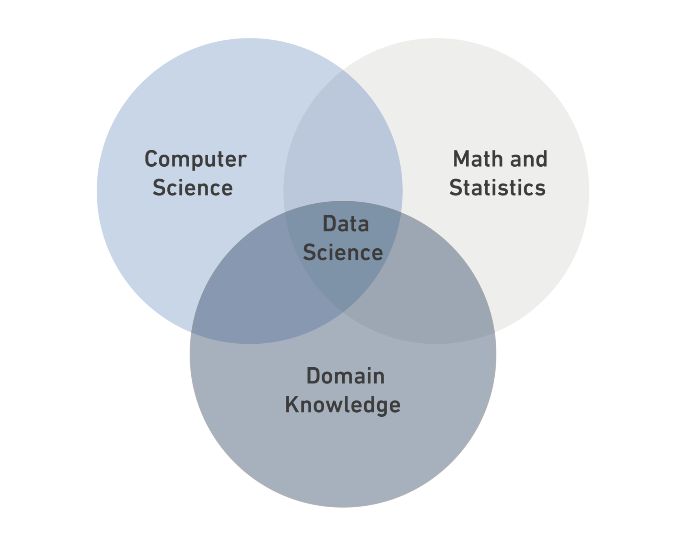

# Data Science
---
## What is Data Science?
---

**Data Science** is a *multidisciplinary field* that combines statistics, computer science, and domain knowledge.

### Data Types:
<ul>
<li>Structured Data</li>
<li>Semi-Structured Data</li>
<li>Unstructured Data</li>
</ul>

| Structured Data                                         | Semi-Structured Data                                                | Unstructured Data             |
|---------------------------------------------------------|---------------------------------------------------------------------|-------------------------------|
| It is data that has been organized into a strict schema | It is data that does not confirm to a schema but has some structure | It is data that has no schema |
| e.g: tables                                             | e.g: xml                                                            | e.g: photos                   |

`Print("DS Bootcamp")`

[Read more](https://en.wikipedia.org/wiki/Data_science)
